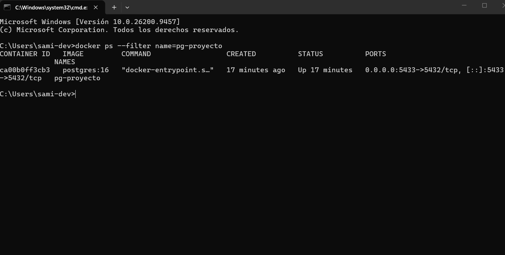
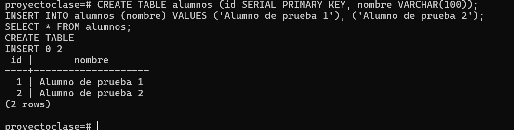
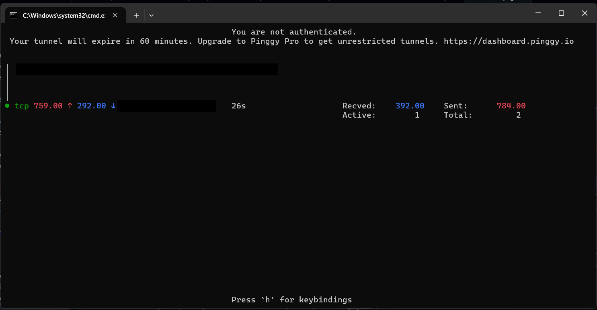
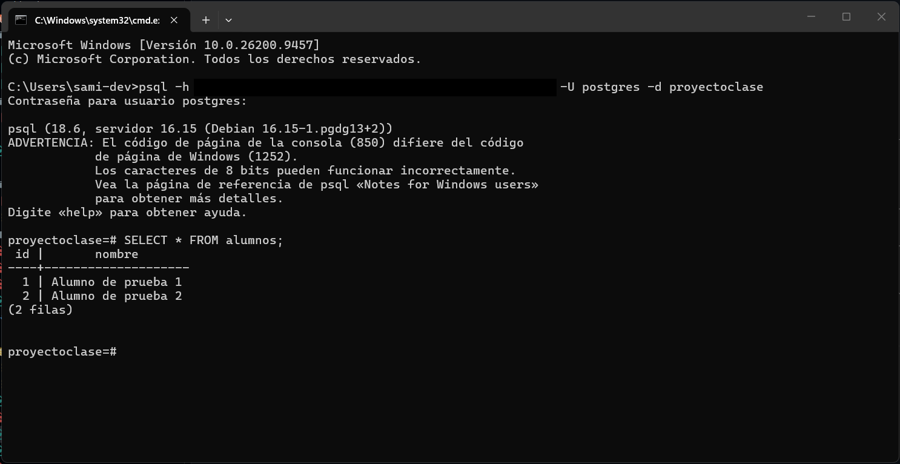

# Actividad 1: Túnel a una base de datos PostgreSQL con Pinggy

## 1. Objetivo

Crear un **túnel TCP público** con [Pinggy](https://pinggy.io) hacia una base de datos PostgreSQL que corre en mi computadora dentro de un contenedor Docker, para que el profesor pueda conectarse con la dirección generada desde cualquier lugar, sin abrir puertos en el router ni tener IP pública.

> La base de datos es **solo de prueba** (tabla `alumnos`). El objetivo es demostrar el túnel, no el diseño de la BD.

## 2. Cómo funciona

```
 Profesor (cualquier lugar)
        │  psql -h <host_pinggy> -p <puerto_publico> -U <usuario> -d proyectoclase
        ▼
 ┌───────────────────┐
 │  Servidor Pinggy  │   ← dirección pública (host + puerto)
 └─────────┬─────────┘
           │  túnel TCP reverso sobre SSH (lo inicio yo desde mi PC)
           ▼
 ┌───────────────────┐
 │  Mi computadora   │
 │  Docker           │
 │  └ PostgreSQL     │   ← puerto local 5433
 └───────────────────┘
```

## 3. Herramientas

| Herramienta | Uso |
|---|---|
| Windows (CMD / Git Bash) | Terminal para correr los comandos |
| Docker | Contenedor donde corre PostgreSQL |
| PostgreSQL 16 | Motor de la base de datos |
| `psql` | Cliente para probar la conexión |
| Pinggy (plan gratuito) | Túnel TCP público |
| OpenSSH | Pinggy funciona sobre SSH |
| Teams | Canal por el que se enviaron los accesos al profesor |

## 4. Procedimiento

### Paso 1. Levantar PostgreSQL en Docker

```bash
docker run --name pg-proyecto \
  -e POSTGRES_PASSWORD=<contraseña> \
  -e POSTGRES_DB=proyectoclase \
  -p 5433:5432 \
  -d postgres:16
```

El contenedor se publica en el puerto **5433** de mi PC (y escucha en el 5432 por dentro). Más abajo explico por qué no usé el 5432.

Verificar que está corriendo:

```bash
docker ps --filter name=pg-proyecto
```



### Paso 2. Crear la tabla de prueba

Entrar a la base dentro del contenedor:

```bash
docker exec -it pg-proyecto psql -U postgres -d proyectoclase
```

```sql
CREATE TABLE alumnos (
  id SERIAL PRIMARY KEY,
  nombre VARCHAR(100)
);

INSERT INTO alumnos (nombre) VALUES
  ('Alumno de prueba 1'),
  ('Alumno de prueba 2');

SELECT * FROM alumnos;
```



### Paso 3. Abrir el túnel TCP con Pinggy

```bash
ssh -p 443 -R0:localhost:5433 tcp@a.pinggy.io
```

- `-p 443`: se conecta a Pinggy por el puerto 443.
- `-R0:localhost:5433`: reenvía lo que llegue al puerto público hacia el puerto 5433 de mi PC, donde está el contenedor.
- `tcp@a.pinggy.io`: pide un túnel de tipo **TCP** (el HTTP no sirve para bases de datos).

Pinggy imprime una dirección con esta forma:

```
tcp://<host_pinggy>:<puerto>
```



> ⚠️ El túnel solo vive mientras la terminal esté abierta. En el plan gratuito Pinggy avisa que **expira en 60 minutos**, y la dirección cambia cada vez que se reinicia el túnel.

### Paso 4. Probar la conexión por la dirección pública

Para comprobar que funciona, me conecté usando la dirección pública del túnel (no `localhost`), de modo que el tráfico sale a internet y regresa a mi contenedor a través de Pinggy:

```bash
psql -h <host_pinggy> -p <puerto> -U <usuario> -d proyectoclase
```

```sql
SELECT * FROM alumnos;
```



### Paso 5. Enviar los accesos al profesor

Los datos de conexión se enviaron por mensaje privado en Teams:

| Dato | Valor |
|---|---|
| Host | `<host_pinggy>` |
| Puerto | `<puerto>` |
| Base de datos | `proyectoclase` |
| Usuario | `<usuario>` |
| Contraseña | `<contraseña>` |

Por seguridad, los valores reales **no** se publican en este repositorio, y por eso tampoco se incluye captura del mensaje.

## 5. Problemas encontrados y soluciones

| Problema | Causa | Solución |
|---|---|---|
| `psql: error: ... Name or service not known` / `Non-existent domain` | La dirección de Pinggy cambia cada vez que se reinicia el túnel, y estaba usando una dirección anterior | Copiar la dirección nueva que muestra la terminal del túnel y comprobarla con `nslookup` antes de conectar |
| `FATAL: la autentificación password falló` aunque la contraseña era correcta | Había **dos procesos escuchando en el puerto 5432** (el contenedor de Docker y otra instancia de PostgreSQL en Windows), así que la conexión llegaba al servidor equivocado. Lo comprobé con `netstat -ano \| findstr :5432` | Recreé el contenedor publicándolo en el puerto **5433** (`-p 5433:5432`) y abrí el túnel hacia ese puerto |

## 6. Seguridad

- Los accesos se enviaron por privado, no en el repositorio.
- Las capturas tienen tapados el host, el puerto y mi IP pública.
- El túnel se cierra cuando no se usa (`Ctrl + C`).
- Mejora pendiente: para una próxima vez, crear un usuario de solo lectura para el profesor en vez de compartir el superusuario `postgres`.

## 7. Conclusión

Aprendí a crear un túnel de forma gratuita y bastante accesible. El único inconveniente que encontré fue la duración del túnel, que en el plan gratuito solo me permitía una hora. Aun así, durante mi investigación me di cuenta de que existe una gran variedad de servicios que resuelven esta problemática; la diferencia está en el plan (en su mayoría tienen un costo) y en las herramientas para llevarlo a cabo.